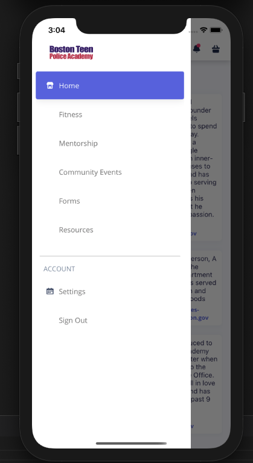
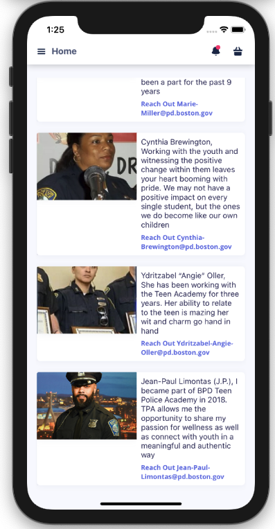
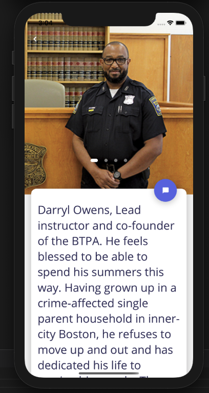

# Boston Teen Police Academy

### Video Demo

## User Story

As a teen student of the Boston Police Teen Academy I will find it valuable to have healthy tools for my journey through the difficult teen years all at my fingertips.  I will have access to my mentors while participating in the program as well as after completion which is very important for continued connection and development.  There will be easy access to so many tools to continue the trend of self development, improvement and care as well as personal safety for myself, my family, my friends and my community as a whole. I also will have access to free educational tools and resources for college prep and funding easily available to myself and my family. I can track my personal growth and improvement of fitness and general mood throughout the program as well as beyond with a PT tracker and a self assessment survey that is stored in my user profile. These tools can also be used as a guide by my mentors if I choose to share.  Being an inner city teens having all of these powerful resources in one place with ease of access could ultimately be a game changer for one or for many.

> # Technology Used
> - HyperText Markup Language
> - Cascading Styles Sheets
> - Bootstrap 4
> - javascript ES6
> - jQuery
> - Moments.js
> - Google Places API
> - Open Weather API
> - React Native
> - Node.js
> - Express.js
> - Sequelize.js
> - AWS RDS

# Future Enhancements

1. Location Tracker for the busses
2. Survey for mental health and safety that will be stored in a database
3. User profiles and fitness trackers
4. Calender of community events
5. Reliable connection with mentors via community wall
6. Daily positive affirmations

# Support
If you need support please contact James Hudgins @ james.hudgins.work@gmail.com.
                                   Ursala Lindsey @ lindsey50@comcast.net           
                                   Andy Pierson @ Pierson.eamon@gmail.com
                                   Carrye Gaulin @ carryegaulin111@gmail.com

